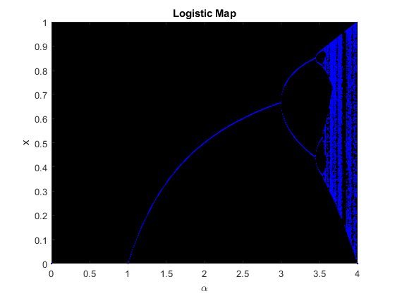

# Logistic Map – Diagramma di Biforcazione

Questo progetto mostra il comportamento dinamico della **Logistic Map**, un esempio di sistema dinamico non lineare caotico, utilizzando **MATLAB**.

La Logistic Map è descritta dalla relazione ricorsiva:

xₙ₊₁ = ρ · xₙ · (1 − xₙ)

Al variare del parametro ρ, il sistema mostra una ricca varietà di comportamenti: da punti fissi stabili a biforcazioni, fino al caos deterministico.

## Obiettivo

Il programma calcola e visualizza il diagramma di biforcazione della Logistic Map per valori del parametro ρ compresi tra 0.5 e 4.  
Per ogni valore di ρ, vengono analizzati gli ultimi valori di `xₙ` dopo un certo numero di iterazioni, identificando i punti fissi e tracciandoli.

## Programmi utilizzati

- MATLAB

## Come tilizzarlo

- scaricare il file `LogisticMap.m`
- aprirlo in MatLab
- runnare il codice

## Output

Il grafico risultante mostra il valore di `x` all’equilibrio (o nei cicli) in funzione del parametro ρ. Il colore nero su sfondo scuro evidenzia il comportamento del sistema, rendendo visibili biforcazioni e transizioni caotiche.

## File presenti

- `LogisticMap.m` — Codice MatLab che genera il diagramma
- `Logistic_map.png` — Immagine del grafico del grafico

##  Note

In futuro sarà aggiunta anche una **versione Python** per rendere il progetto accessibile a un pubblico più ampio e mostrare versatilità su più linguaggi.

Il progetto è stato realizzato come esercizio personale di analisi dati.

~ Loris Manganiello
